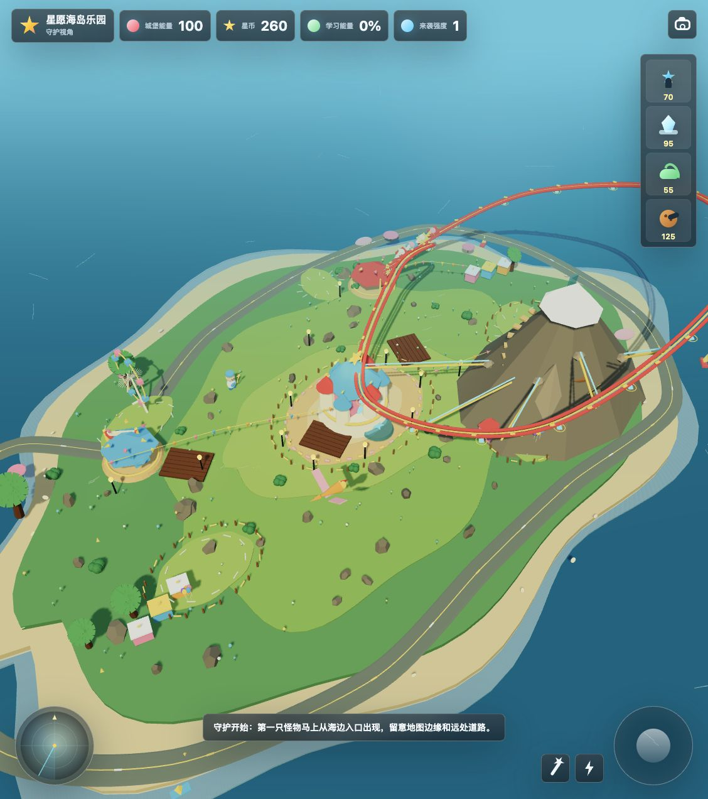

# 星愿海岛乐园守护

《星愿海岛乐园守护》是一个发生在海岛游乐场里的 3D 守护游戏。玩家作为岛主在岛上守护城堡、建造炮塔、打怪兽，也可以切换到第一人称视图，坐过山车、坐卡丁车、探索整座乐园，并通过答题补充学习能量。

当前项目只保留星愿海岛乐园这一条主线：一个入口、一套样式、一份游戏逻辑、一组乐园地图素材。



## Features

- Three.js 3D 乐园场景，叠加一张可交互的星愿海岛总览地图。
- 岛主可以在守护者视图和第一人称视图之间切换。
- 游乐场设施包括过山车、卡丁车、山路、码头、城堡广场和海岛道路。
- 怪兽会从海岛边缘来袭，玩家需要建造炮塔并用星杖、城堡闪电协助防守。
- 星光电塔、冰晶塔、藤蔓花坛、饼干炮车四类建造单位。
- 城堡能量、星币、学习能量和来袭强度组成的当前玩法循环。
- 设施探索、怪物来袭、炮塔升级/回收、星杖攻击、城堡闪电和答题补能。

## Run Locally

No build step is required. Serve the folder with any static file server:

```bash
python3 -m http.server 8020 --bind 127.0.0.1
```

Then open:

```text
http://127.0.0.1:8020/
```

Opening `index.html` directly redirects to the local server URL because the game uses ES modules.

## Project Structure

```text
steam_island_defense/
├── index.html
├── park.css
├── src/
│   └── park-game.js
├── assets/
│   └── park/
│       ├── starwish-asset-atlas-magenta.png
│       └── starwish-overview-map.png
├── docs/
│   ├── screenshots/
│   │   └── starwish-park-gameplay.png
│   ├── starwish-park-concept.png
│   └── starwish-park-version-plan.md
├── vendor/
│   └── three.module.js
└── README.md
```

## Useful Checks

```bash
node --check src/park-game.js
```

## License

MIT License. This project is open for anyone to use, modify, and share.
