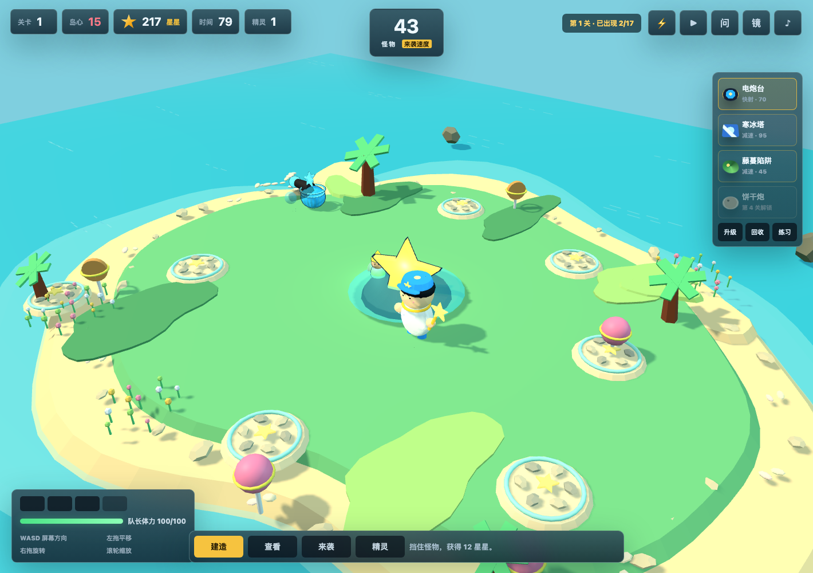

# Steam Island Defense

《岛屿保卫战 3D》是一款儿童向 3D 小岛塔防学习游戏原型。它的起点很简单：我和小岛小朋友骑车时一路聊天，突然冒出了“做一个小岛保卫战学习游戏”的想法。晚上我把骑车时讨论的录音丢给 Codex，第二天早上，这个可玩的原型就自动开发出来了。

玩家扮演小岛队长，在草地、沙滩和浅海建造防御设施，守住生命核心，并通过节奏化的学习练习获得星币和生命补给。



## Features

- 3D toy-like island defense scene built with Three.js.
- Tablet-first controls: right-side virtual joystick, touch build flow, pinch zoom and rotate.
- Simplified combat UI: choose a tower, tap to build, tap an existing tower to upgrade or recycle.
- Buildable terrain includes grass, beach, and shallow water.
- Four tower types: spark turret, frost tower, vine trap, and unlockable cookie cannon.
- Kid-friendly learning loop: short math/language/science/English questions appear with game rhythm and reward the player.
- Clear resource language: `生命` is base health, `星币` is the build and upgrade currency.
- Default music and sound effects are enabled after the first browser interaction.

## How To Play

- Move the captain with the right-side joystick.
- Tap the map with no tower selected to move the captain.
- Tap a tower button on the right, then tap grass, beach, or shallow water to build.
- Tap the same tower button again to cancel build mode.
- Tap an existing tower to open the nearby `升级 / 回收` menu.
- Use the top buttons for lightning, captain attack, starting a wave, learning practice, and audio.
- Answer learning questions to regain life or earn star coins.

## Run Locally

No build step is required. Serve the folder with any static file server:

```bash
python3 -m http.server 8020 --bind 127.0.0.1
```

Then open:

```text
http://127.0.0.1:8020/
```

Opening `index.html` directly can work in some browsers, but a local server is recommended because the game uses ES modules.

## Project Structure

```text
steam_island_defense/
├── index.html              # Game shell and UI
├── styles.css              # HUD, touch controls, quiz, and responsive layout
├── src/
│   ├── three-game.js       # Current 3D game implementation
│   └── game.js             # Earlier canvas implementation/reference
├── assets/                 # Character, enemy, tower, UI, and concept art assets
├── docs/                   # Art direction, prompts, and implementation notes
├── vendor/
│   └── three.module.js     # Vendored Three.js module
└── README.md
```

## Development Notes

The current prototype is intentionally dependency-light:

- Plain HTML/CSS/JavaScript.
- Three.js is vendored in `vendor/`.
- No bundler, package manager, or build pipeline is required.

Useful checks:

```bash
node --check src/three-game.js
```

Recommended manual QA:

- Open on a tablet-sized viewport.
- Confirm the joystick stays on the right.
- Confirm tapping the map moves the captain when no tower is selected.
- Confirm tower build mode can be selected, cancelled, and auto-cleared after build.
- Confirm grass, beach, and shallow water construction works.
- Confirm learning practice appears with game rhythm and uses varied questions.

## Current Status

Playable prototype. The game has a complete local loop for movement, building, waves, tower upgrades, recycling, combat, learning questions, music, and basic persistence.

## Roadmap

- Add more levels and enemy behaviors.
- Expand the learning question bank by age and topic.
- Add a parent/teacher progress view.
- Improve tower upgrade visuals by level.
- Add polished start, pause, and result screens.
- Package for web deployment.

## License

MIT License. This project is open for anyone to use, modify, and share.
