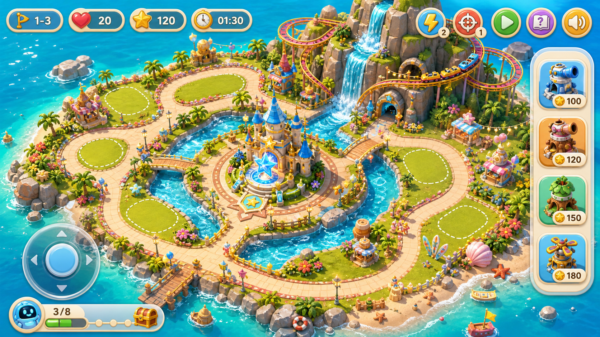

# 星愿海岛乐园守护 - 完整计划

> 本文档整理当前对话中已经确定的全部目标、结论和硬性要求。后续实现必须以本文档为准，不把当前可玩草稿当成发布级成果。

## 1. 项目定位

项目目标是做成一款真实可交互的 3D 儿童学习防守游戏：

- 场景是一个白天的海岛主题乐园。
- 玩法不是传统关卡通关，而是无尽游玩、持续守护、持续出题、持续刷怪。
- 玩家可以在守护视角建造防御，也必须可以切到第一人称视角自由探索全岛。
- 视觉、交互、结构都必须围绕星愿海岛乐园独立展开。

## 2. 概念画面

这张图是视觉方向参考，后续 3D 场景的丰富度、色彩、层次、立体感、主题乐园氛围都要向它靠近。

关键视觉要求：

- 画面必须美观、丰富、细节多，不能像草稿图。
- 整体是明亮、童话、梦幻、白天、海岛乐园风格。
- 可以借鉴主题乐园气质，但不能使用 Disney / 迪士尼的 IP、Logo、角色、城堡造型复刻或受保护形象。
- 场景要有强 3D 感，建筑、山体、河流、过山车、道路、装饰物必须有真实空间层次。
- 第一眼要能看出这是一个完整海岛乐园，而不是几个简单模型摆在平面上。

## 3. 世界设定

整体还是一座岛，但岛上不是普通自然岛，而是一座完整的海岛主题乐园。

必须包含：

- 中央守护城堡或核心建筑。
- 环岛海水、沙滩、浅水区域。
- 岛内河流。
- 山体和可攀爬山路。
- 极速飞车/过山车项目。
- 可乘坐的小船或河流游船。
- 可自由走动的步道、广场、桥、码头。
- 多个主题区域，例如城堡广场、飞车区、河流区、山地区、沙滩区、补给/商店区。
- 丰富装饰，例如树、花、旗帜、灯、摊位、栅栏、石头、贝壳、水花、轨道支架、排队入口等。

当前只做白天版本，不做夜晚和烟花 Boss 版本。

## 4. 视角系统

新版本必须有两个核心视角。

### 4.1 游戏守护视角

用于完整观看全岛、建造炮塔、防守怪物、管理资源。

必须支持：

- 俯视或斜俯视 3D 摄像机。
- 可旋转、缩放、查看全岛。
- 点击岛上合适区域建造。
- 查看怪物来袭方向和防守情况。
- 一键切换到第一人称。

### 4.2 第一人称视角

这是硬性要求，不是附属镜头。

孩子在第一人称里必须可以：

- 在全岛自由走动。
- 走到沙滩。
- 走到河边和河里面。
- 坐船。
- 坐过山车。
- 爬山。
- 靠近项目入口互动。
- 攻击怪物。
- 从第一人称体验游乐项目，而不是只在俯视视角看动画。

第一人称必须尽可能自由，但也要考虑儿童体验：

- 移动要顺滑。
- 不要强烈晃动导致眩晕。
- 需要有舒适模式思路，例如减少镜头抖动、减少过山车极端旋转。
- 需要有一键返回城堡或项目出口机制，避免玩家卡住。

## 5. 真实游乐项目

游乐项目不能只是装饰，必须是真实可互动的游戏内容。

### 5.1 过山车

过山车是核心亮点，必须真实可动。

要求：

- 轨道是 3D 曲线，有高低起伏、转弯、俯冲、爬升。
- 过山车列车沿轨道持续运动。
- 玩家第一人称可以坐上去。
- 坐上去后摄像机跟随列车运动，有速度感和刺激感。
- 过山车不能只是贴图或静态模型。
- 守护视角下过山车也应该持续运行。
- 过山车可以和防守玩法产生联系，例如经过某区域时给炮塔加速、给城堡充能、吸引怪物或触发奖励。

### 5.2 小船

小船也是可互动项目。

要求：

- 小船沿河流或水路运行。
- 玩家第一人称可以坐船。
- 坐船时可以看见河流、桥、岸边景物。
- 小船可以带来补给、星币、学习能量或防守奖励。

### 5.3 山

山不是背景。

要求：

- 玩家可以爬山或沿山路走上去。
- 山上可以作为观察点，看到怪物入口、全岛路线、过山车和城堡。
- 山体需要有真实高度、台阶、平台、岩石和植被。

## 6. 战斗与防守玩法

核心玩法从“关卡制”改为“无尽海岛乐园守护”。

已确定：

- 不需要传统关卡。
- 游戏一直进行。
- 怪物持续出现。
- 题目持续出现。
- 玩家一直守护乐园。
- 失败不应该是传统 Game Over，而是乐园短暂停电或城堡能量不足。
- 通过学习挑战可以重新点亮城堡、恢复防守。

推荐节奏：

- 平静探索期：玩家可以走动、坐项目、建塔、收集补给。
- 小规模怪物来袭。
- 乐园事件，例如小船补给、飞车充能、山顶警报。
- 大规模怪物来袭。
- 强怪或 Boss 型事件。
- 回到平静探索期，但强度逐渐提升。

需要保留和升级：

- 生命值/城堡能量。
- 学习能量。
- 星币或建造资源。
- 怪物波次压力，但不叫传统关卡。
- 炮塔建造、升级、回收。
- 玩家主动攻击。
- 技能，例如闪电、护盾、星杖技能。

## 7. 第一人称战斗

第一人称里玩家可以攻击怪物，但不做过于复杂或硬核的 FPS。

要求：

- 玩家手里可以有星杖或类似儿童友好的武器。
- 支持近距离攻击或星光弹。
- 需要有柔和的自动瞄准或辅助命中。
- 攻击反馈要清楚：光效、音效、怪物受击、奖励。
- 怪物可以在乐园里移动，但不能造成过强恐怖感。
- 战斗要适合儿童，不血腥、不惊吓。

## 8. 学习系统

现有题库必须全部保留，并可以扩展。

题型范围：

- 数学。
- 语文。
- 英语。
- 科学常识。
- 安全与生活常识。

学习系统要求：

- 不再只作为打断式弹窗。
- 可以和乐园事件结合，例如城堡补能、飞车维修、小船补给、山顶雷达、精灵训练。
- 答题可以恢复城堡能量、获得星币、获得学习能量、强化炮塔。
- 怪物一直来，题目也一直生成。
- 答错不能惩罚太重，应鼓励继续答。
- 数学题可以动态生成，静态题库也要保留。

## 9. 建造系统

守护视角需要完整建造体验。

要求：

- 玩家可以在全岛大部分合适区域建造。
- 海滩、草地、浅水边等可建区域要清晰。
- 深水、轨道、项目入口、山体陡坡、核心建筑附近不能随意建。
- 建造不能堵住玩家行走、过山车、小船或怪物路径。
- UI 要清楚显示选中的塔、费用、可建/不可建反馈。

炮塔方向：

- 星光电塔：快速攻击。
- 冰晶塔：减速。
- 藤蔓/花坛陷阱：范围减速或控制。
- 饼干炮/糖果炮：范围爆炸。
- 后续可以加入乐园主题塔，例如旋转木马塔、气球塔、喷泉塔。

## 10. UI 设计要求

UI 要保持星愿海岛乐园自己的游戏化风格。

守护视角 UI：

- 顶部状态栏：城堡能量、星币、学习能量、来袭强度、乐园时间。
- 右侧或底部建造工具栏：用图标和价格表达炮塔。
- 快捷按钮：切视角、攻击/指挥、闪电技能、学习挑战、声音。
- 小地图：显示玩家、城堡、怪物、项目区域。
- 状态提示：短句说明当前事件。

第一人称 UI：

- 中央准星。
- 互动提示。
- 攻击按钮。
- 技能按钮。
- 切回守护视角。
- 移动摇杆或键盘支持。
- 不要用大段说明文字占画面。

UI 风格：

- 儿童友好。
- 清晰、精致、不拥挤。
- 不能像调试面板。
- 不能只用文字按钮，需要图标化、游戏化。

## 11. 画面品质标准

这是本次新版本最重要的验收点之一。

不能接受：

- 平面草稿图。
- 几何体随便堆。
- 空岛加几个简单模型。
- 缺少装饰细节。
- 第一人称看起来像穿模或空白。
- 过山车只是摆设。
- UI 像开发调试工具。

必须达到：

- 岛屿地形有层次。
- 河流有形状和水面效果。
- 山体有高度、路径、石头和植被。
- 过山车有轨道、支架、车站、运行列车。
- 城堡或核心建筑有完整主题感。
- 乐园有足够多装饰物和小区域。
- 第一人称看到的不是空旷平面，而是可探索空间。
- 手机和桌面都能适配。

## 12. 发布级验收标准

用户要求是“直到 100% 可以发布级别的产品”，因此不能把简单原型说成完成。

发布级至少需要：

- 游戏入口完整独立。
- 没有明显控制台错误。
- 主要交互全部可用。
- 第一人称和守护视角都可稳定游玩。
- 过山车和小船真的可乘坐。
- 怪物无尽循环稳定。
- 学习题库稳定出题。
- UI 不遮挡、不乱、不溢出。
- 桌面和移动端都能玩。
- 视觉达到概念图方向，而不是草稿。
- 有明确的新手引导，但不靠大段说明文字。
- 有保存或至少有本局持续进度。
- 有发布前 QA 截图和功能检查。

## 13. 当前偏差记录

当前已有的 `index.html` / `park.css` / `src/park-game.js` 只能视为可玩草稿，不是最终产品。

主要问题：

- 画面复杂度不足，距离概念图还有明显差距。
- 第一人称自由度和项目互动还不够完整。
- 过山车、船、山虽然有初步实现，但距离真实可玩项目还不够。
- UI 是新做的，但还没达到发布级游戏 UI。
- 没有完整的 QA 报告、移动端验证和视觉验收。
- 不能把“无控制台错误 + 能跑”当作“发布级完成”。

后续实现必须以本文档为目标，而不是以当前草稿为目标。

## 14. 后续执行原则

后续开发时必须遵守：

- 先对齐本文档，再动代码。
- 不再把半成品说成发布级。
- 只围绕星愿海岛乐园的素材、地图和交互推进。
- 每次实现都要围绕完整产品体验推进。
- 视觉、交互、学习、防守、第一人称必须同步考虑。
- 发布前必须做真实浏览器验证、截图验证和交互验证。
